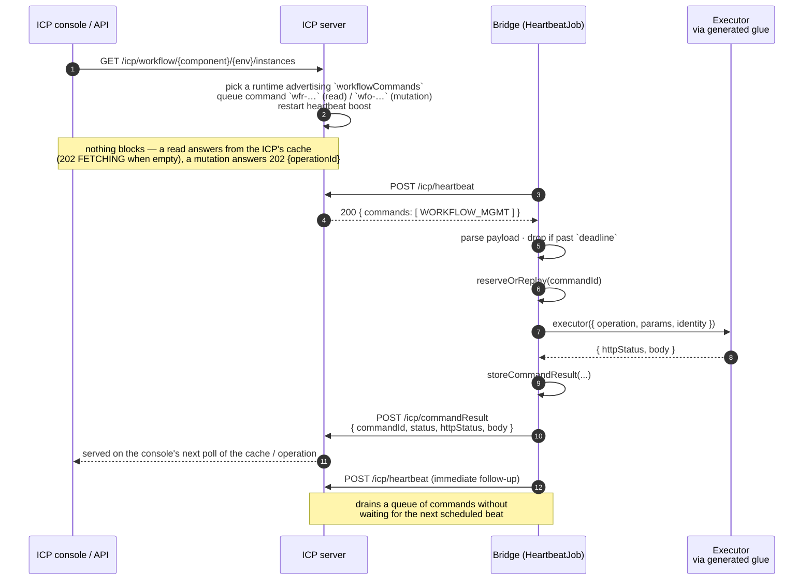
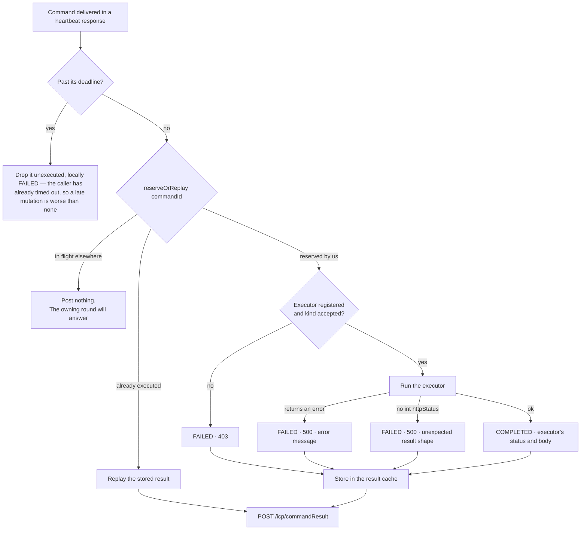

# The command tunnel

How the ICP asks a runtime to *do* something, without ever opening a connection to it.

The bridge's heartbeat is a one-way, client-initiated channel: the integration dials out, the ICP
answers. That is excellent for pushing state up and useless for pulling anything back down — and
workflow management (list instances, complete a human task, terminate an instance) is all pull.

The tunnel closes that gap without changing the direction of a single connection. A command is
queued on the ICP, delivered inside a heartbeat **response**, executed in-process by the
integration, and answered on a second outbound call. Nothing listens on the integration; no route,
port, or credential has to exist for the control plane to reach it.

- **Generic plumbing:** [`ballerina/command_tunnel.bal`](../ballerina/command_tunnel.bal)
- **Delivery and dispatch:** `handleTunneledCommand` in [`ballerina/main.bal`](../ballerina/main.bal)
- **The first command kind:** [`ballerina/workflow_integration.bal`](../ballerina/workflow_integration.bal)

## The round trip

Two things in that picture are the whole design:

- **Step 5 is not a new connection.** It is the response body of the request the integration made
  in step 4. That is why nothing has to be reachable on the integration side.
- **The bridge never interprets the operation.** It hands `{operation, params, identity}` to an
  executor and relays whatever comes back. The vocabulary belongs to the management API, not here.

## What travels

**Control command** (in the heartbeat response, `ControlCommand` in `types.bal`)

| Field | Meaning |
|---|---|
| `commandId` | Correlation ID, also the at-most-once key |
| `action` | `WORKFLOW_MGMT` — selects the executor |
| `payload` | A `TunneledCommandPayload` as a JSON string |

**Command payload** (`TunneledCommandPayload`)

| Field | Meaning |
|---|---|
| `commandId` | Same ID; the result is posted under it |
| `operation` | Dot-qualified operation, e.g. `humanTasks.complete` |
| `params` | Operation parameters, keyed as the management API expects |
| `identity` | `{userId, roles}` — the end user the ICP acts for |
| `deadline` | ISO-8601 instant after which the command is dropped unexecuted |

**Result** (`TunneledCommandResult`, posted to `POST /icp/commandResult`)

| Field | Meaning |
|---|---|
| `runtimeId` | This runtime |
| `commandId` | The correlation ID the ICP is waiting on |
| `status` | `COMPLETED` when the operation executed, `FAILED` when it could not |
| `httpStatus` | The status the management API would have returned |
| `body` | The response body — the same JSON values that API returns. It is re-serialized in transit, so formatting (whitespace, key order) may be normalized; the values are not. |

`status` and `httpStatus` answer different questions, and conflating them is the easy mistake:
**`status` is about the tunnel, `httpStatus` is about the operation.** A `humanTasks.get` for a
task that does not exist is `COMPLETED` with `404` — the runtime was asked and answered. `FAILED`
means the tunnel could not obtain an answer: the command kind is not accepted by this runtime,
the executor itself failed, or its result was unusable.

## At-most-once execution

Redelivery is normal: a heartbeat can be retried, a result can be lost after the operation already
ran, and two rounds can overlap. For reads that is harmless; for `humanTasks.complete` it is not.
So a `commandId` is reserved atomically *before* execution, and its result is kept for replay.

Strictly, the guarantee is at-most-once **within the retention window**: the cache holds a
nominal `PROCESSED_COMMAND_CACHE_CAPACITY` (512) results evicted oldest-first, but an entry
younger than `PROCESSED_COMMAND_MIN_AGE_SECONDS` (300s) is never evicted to make room — the
cache grows past its nominal capacity instead, so a burst of reads cannot push a mutation's
result out inside the redelivery window. A redelivery arriving after its id has aged out and
been evicted executes again. The bound is deliberate — replay protection must not grow without
limit — and it lines up with the ICP's own retention: a confirmed operation is kept there for
300s for the console to poll, the same window this cache guarantees a replay. A future
command kind whose mutations cannot tolerate that window must bring its own idempotency (an
operation-level key), not a bigger cache.

The 403 arm deserves a note. The capability is advertised only while a workflow integration is
registered *and* `enableWorkflowManagement` is true, so a command arriving when either is false
means the server gated wrongly or the configuration changed since the last heartbeat. The bridge
refuses it rather than executing something the deployment has switched off.

## Timing

Latency is bounded by heartbeat cadence, not by a network call:

| | |
|---|---|
| ICP deadlines | Nothing is held open on the ICP: a read command carries a 60s deadline (past it the view reports the failure and retries on the next visit); a mutation carries a **30-minute** deadline, so a user's action survives an integration restart instead of failing fast |
| First command after idle | Up to one full `heartbeatInterval` (default **10s**) — a faster cadence can only take effect on the *next* beat; the console shows FETCHING meanwhile |
| While someone is working | ~1s: the ICP asks for a 1s cadence, decaying 2s → 5s → 10s and off after 30s idle |
| A burst of commands | Drains immediately — after executing one, the bridge heartbeats again at once instead of waiting for the next tick |
| Within one batch | Commands execute concurrently in chunks of `tunneledCommandConcurrency` (default 4, clamped to ≥1), mutations delivered before reads by the ICP |

The `deadline` in the payload is the bridge's own guard: a command whose deadline has passed is
dropped unexecuted (reported FAILED locally), because the caller has already given up and a late
mutation is worse than none. A deadline that cannot be parsed is refused the same way — an
unassessable deadline is no license to run without one.

## Capability gating

`currentCapabilities()` advertises `workflowCommands` only when both hold:

- a workflow integration has registered an executor (the generated glue ran), and
- `enableWorkflowManagement` is true (the default; set it to false to stop this runtime's
  workflows being managed from the ICP).

The ICP sends `WORKFLOW_MGMT` only to runtimes that advertised it, so the integration — not the
control plane — decides whether it may be managed remotely.

`capabilities` is sent on every full heartbeat without field negotiation, unlike `workflowMetadata`
and `openApiDefinitions`. That is deliberate: the ICP parses the heartbeat as an **open record**, so
a field it does not know is ignored rather than rejected. Negotiation exists to avoid sending
payload-heavy *documents* a server cannot use, not as a compatibility gate for every new field.

## Adding a new tunneled command kind

The plumbing is generic; a new kind needs four small pieces and no changes to
`command_tunnel.bal`:

1. **Add the action** to the `ControlAction` enum in `types.bal` (e.g. `CONFIG_MGMT`).
2. **Register an executor** — an `isolated function (map<json>) returns map<json>|error` that runs
   the operation and returns `{httpStatus, body}` exactly as its HTTP API would have answered.
   Follow `registerWorkflowIntegration` if the executor comes from generated glue.
3. **Advertise a capability** from `currentCapabilities()`, gated on whatever opt-in the feature
   has, so the ICP only sends the command to runtimes that accept it.
4. **Bind the action** — add one arm to `tunneledCommandBinding` in
   [`ballerina/main.bal`](../ballerina/main.bal), mapping the action to its executor and its
   opt-in flag. That function is the single dispatch point: the routing in
   `handleControlCommands` and the execution in `handleTunneledCommand` both pick the new kind
   up from this binding alone, so there is no second match to keep in sync. An action that
   reaches the bridge without a binding is reported `FAILED`, never silently completed.

Everything else — reservation, replay, result envelope, error mapping, deadline handling, posting —
is already there.

## Boundaries

The bridge has **no dependency on `ballerina/workflow`, in any scope.** Executors are function
pointers registered at run time, and the tunnel only ever sees `map<json>` in and out. The
workflow-specific half lives in the glue this package's compiler plugin generates *into the user's
package*, where the workflow dependency already exists. Keep it that way: an integration that uses
the ICP without workflows must not pull the workflow module in behind it.

## What the tests pin

[`ballerina/tests/command_tunnel_test.bal`](../ballerina/tests/command_tunnel_test.bal) drives
`executeTunneledCommand` with stub executors — no ICP server, no workflow runtime, no Temporal:

- an executed command relays the executor's status and body unchanged, and the executor sees
  `{operation, params, identity}` and nothing about the tunnel;
- a 404 from the executor stays `COMPLETED`, because the operation answered;
- an executor error, and a result with no int `httpStatus`, both report `FAILED` with a diagnostic
  rather than a silent 500;
- an unaccepted kind and a missing executor report `FAILED`/403 without reaching the executor;
- a redelivered `commandId` replays the stored result and executes exactly once;
- a command in flight in another round posts nothing;
- entries younger than the minimum age survive capacity overflow and still replay without
  re-execution; an aged-out, evicted `commandId` executes again;
- an expired deadline and a malformed one both refuse execution; an absent or future one allows it.
